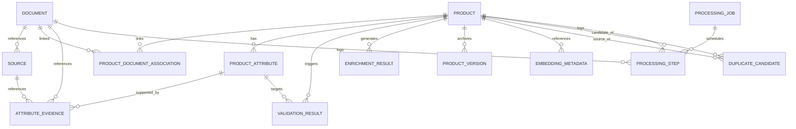

# CatalogIQ Data Model & Schema Design

This document details the relational + JSONB persistence layer implemented in **CatalogIQ** using SQLAlchemy 2.x and SQLModel.

---

## 1. ER Diagram

The following Mermaid diagram outlines the entity relationships, fields, and constraints:

---

## 2. Entities & Schema Definitions

### Core Entities

#### 1. `Product`
Stores stable relational product columns along with dynamic attributes using JSONB.
- **Uniqueness Constraint**: SKU is not globally unique. We enforce unique composite key `(brand, sku)`.
- **JSONB Fields**:
  - `attributes`: Dynamic category-specific technical attributes.
  - `features`: Array of string highlights.
  - `applications`: Array of application environments.
  - `certifications`: Array of industry credentials.
  - `keywords`: Array of search keywords.

#### 2. `Document`
Tracks metadata for uploaded PDFs/images stored on the object storage backend.
- **Fields**: `id`, `filename`, `storage_backend`, `storage_key` (path), `file_hash` (SHA-256), `content_hash`, `mime_type`, `file_size`, `page_count`, `status`, `parser_version`, `metadata`, `created_at`, `updated_at`.
- **Index**: Unique index on `file_hash` to support deduplication.

#### 3. `Source`
Provenance record supporting the evidence-based design.
- **Fields**: `id`, `source_type` (Enum), `name`, `uri`, `document_id` (FK), `metadata`, `trust_level`, `created_at`.
- **ON DELETE Behavior**: `ondelete="SET NULL"` for `document_id`.

---

### Product Intelligence Entities

#### 4. `ProductAttribute`
Stores relational attribute values and metadata. Supports multi-valued attributes by allowing duplicate `(product_id, attribute_name)` rows.
- **Fields**: `id`, `product_id` (FK, CASCADE), `attribute_name` (indexed), `display_name`, `raw_value` (text), `normalized_value` (JSONB), `unit`, `data_type` (Enum), `confidence`, `status` (Enum), `source_type`.

#### 5. `AttributeEvidence`
Detailed reference tracing an attribute back to a document region or external source.
- **Fields**: `id`, `attribute_id` (FK, CASCADE), `source_id` (FK, SET NULL), `document_id` (FK, SET NULL), `page_number`, `evidence_text`, `bbox` (JSONB), `extraction_method`.

#### 6. `ValidationResult`
Stores rules engine outcomes.
- **Fields**: `id`, `product_id` (FK, CASCADE), `attribute_id` (FK, SET NULL), `validation_type` (Enum), `severity` (Enum), `status` (Enum), `message`, `expected_value` (JSONB), `actual_value` (JSONB), `created_at`, `resolved_at`, `resolved_by`.

#### 7. `EnrichmentResult`
Stores AI-generated marketing/SEO text distinct from technical characteristics.
- **Fields**: `id`, `product_id` (FK, CASCADE), `enrichment_type`, `generated_value`, `model`, `prompt_version`, `confidence`, `status`, `created_at`, `approved_at`, `approved_by`.

---

### Governance & Knowledge Reuse

#### 8. `ProductVersion`
Maintains reconstructable product states when changes are committed.
- **Fields**: `id`, `product_id` (FK, CASCADE), `version_number`, `snapshot` (JSONB containing complete product fields), `change_summary`, `pipeline_version`, `schema_version`, `model_metadata` (JSONB), `created_by`, `created_at`.

#### 9. `CacheEntry`
Persistent cache registry.
- **Fields**: `id`, `cache_key` (unique index), `cache_type` (Enum), `input_hash` (indexed), `result_reference`, `model`, `prompt_version`, `schema_version`, `pipeline_version`, `cache_status` (Enum), `created_at`, `expires_at`, `metadata`.

#### 10. `DuplicateCandidate`
Tracks similarity records between products.
- **Integrity Constraints**:
  - `CheckConstraint("product_id < candidate_product_id")` enforces canonical ordering and prevents duplicate pairs.
  - `UniqueConstraint("product_id", "candidate_product_id")` prevents redundant candidate records.
- **ON DELETE**: `CASCADE` on product deletes.

#### 11. `AuditLog`
Tracks actions throughout the catalog lifecycle.
- **Fields**: `id`, `entity_type`, `entity_id`, `action`, `actor_type` (Enum), `actor_id` (nullable), `before` (JSONB), `after` (JSONB), `metadata`, `created_at`.
